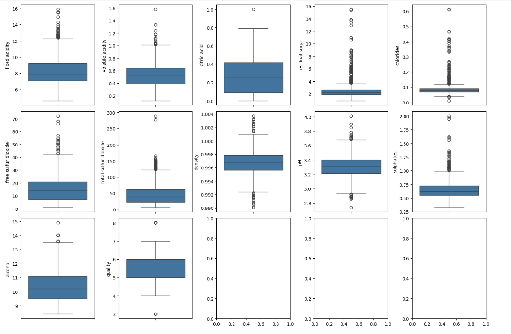
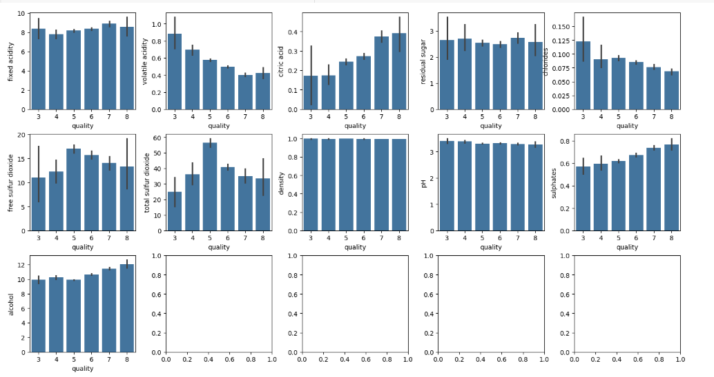
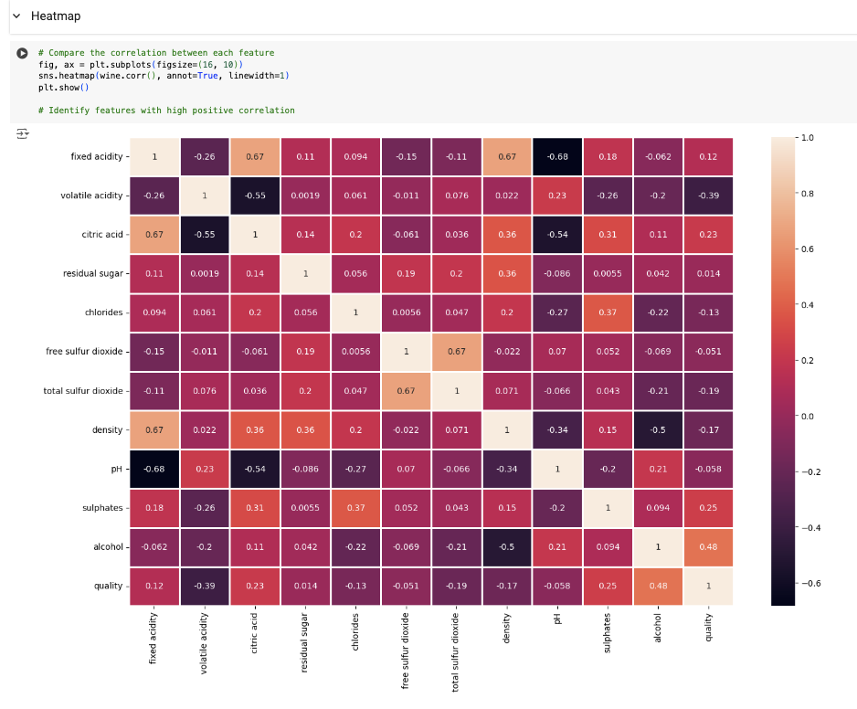
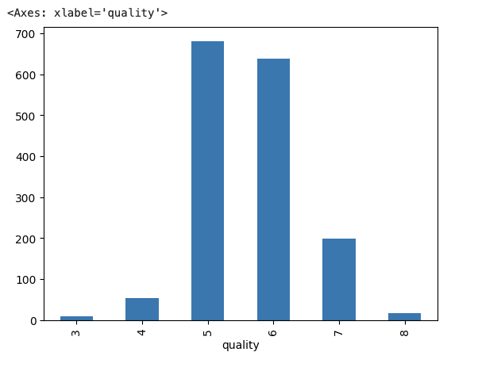
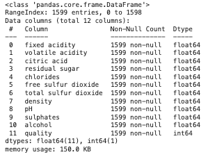
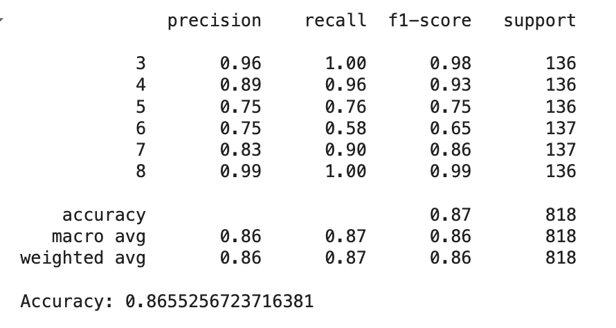
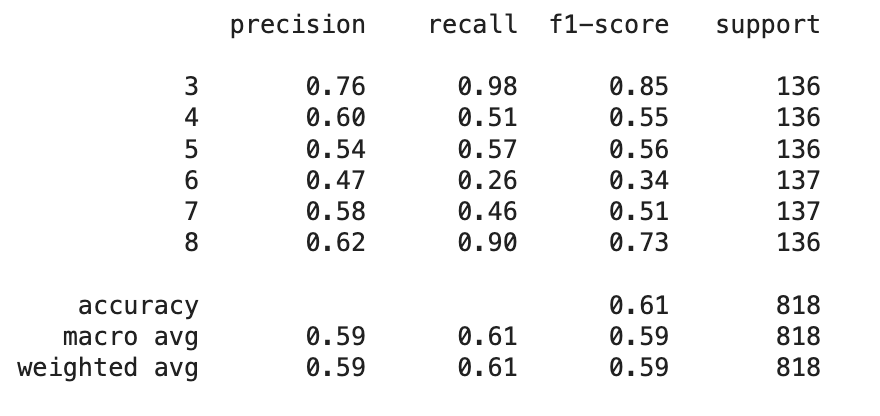
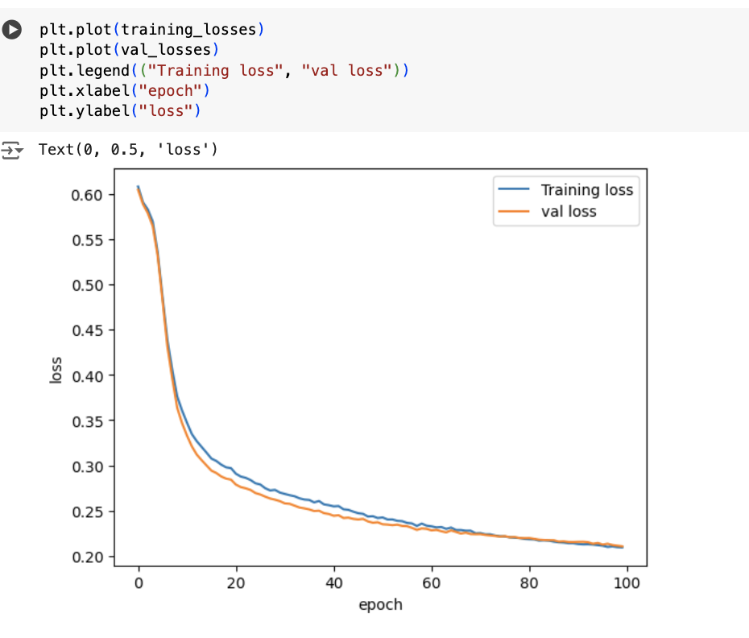

# Prediction of Quality of Wine

This project predicts wine quality using the **Wine Quality** dataset from Kaggle ([link]([https://www.kaggle.com/datasets/mehmetsabrikunt/internet-service-churn/data]). It involves data loading, cleaning, feature analysis, engineering, and addressing class imbalance with SMOTE. Machine learning models are evaluated and optimized to find the best predictor of wine quality based on chemical properties, with a structured workflow for each step.

## Table of Contents
1. [Project Overview](#project-overview)
2. [Dataset](#dataset)
3. [Data Loading](#data-loading)
4. [Feature Analysis](#feature-analysis)
5. [Data Cleaning](#data-cleaning)
6. [Imbalanced Handling (SMOTE)](#imbalanced-handling-smote)
7. [Feature Engineering](#feature-engineering)
8. [Model Analysis](#model-analysis)
9. [Model Optimization](#model-optimization)
10. [Future Work](#future-work)
11. [Contact](#contact)

## Project Overview

The aim of this project is to build a robust wine quality prediction model using machine learning techniques on the **Wine Quality** dataset. The process includes **Imbalanced Handling (SMOTE)** and detailed **Feature Engineering** steps such as **Extract New Features**, **Normalization**, and **Data type conversion**. 

Modeling techniques include:  
- **Hyperparameter Optimization Model**: RandomForest
- **Neural Network Models**: PyTorch, Keras  

Visualizations are presented in **Feature Analysis** and **Model Optimization**, focusing on data insights and performance metrics to identify the most accurate wine quality prediction model.

## Dataset

The **Wine Quality** dataset used in this project is sourced from the [UCI Machine Learning Repository](https://archive.ics.uci.edu/ml/datasets/wine+quality). It contains chemical measurements of red and white wines, such as:

- **Fixed Acidity**: Measures the concentration of non-volatile acids in wine.
- **Volatile Acidity**: Refers to acetic acid in wine, which at high levels can lead to an unpleasant vinegar taste.
- **Citric Acid**: A natural preservative that adds freshness and flavor.
- **Residual Sugar**: The amount of sugar left after fermentation, influencing sweetness.
- **Chlorides**: The amount of salt in the wine.
- **Free Sulfur Dioxide**: Prevents microbial growth and oxidation in wine.
- **Total Sulfur Dioxide**: The total level of SO2, which can affect the flavor if too high.
- **Density**: A factor that can help determine alcohol and sugar levels in wine.
- **pH**: A measure of the acidity/basicity of the wine.
- **Sulphates**: A wine preservative contributing to both the bitterness and microbial stability.
- **Alcohol**: Alcohol content affects the perceived quality and taste.

The **target variable** is the **quality** of wine, scored between 0 and 10, where higher scores represent better quality.

## Data Loading
In this section, we load and examine the raw data to understand its structure, variable types, and key statistics using the following scripts:

- **Unassign_the_Runtime_for_Resetting.py**: Clears the runtime environment to reset cached variables and prevent data conflicts.
- **Upload_the_data.py**: Loads the dataset and performs initial checks, including handling missing values and identifying data types.
- **Definitions_for_the_Columns.py**: Offers detailed descriptions and explanations of each column to improve data comprehension.

### Key Steps:
- Exploring the data: Inspecting missing values, data types, and class distribution.
- Generating summary statistics for both numerical and categorical features.

## Feature Analysis  
The Feature Analysis consists of five key parts: **Statistical Observation**, **Value Range**, **Numerical Features Relationship**, **Heatmap**, and **Class Imbalance**. These steps help in understanding the data distribution, relationships between features, and potential imbalances in the target variable. Further analysis will focus on gaining deeper insights to enhance model performance.

### Statistical Observation
In this section, we perform an initial statistical dataset analysis using the `describe()` function. This provides summary statistics for each feature, including count, mean, standard deviation, minimum, 25th percentile, median (50th percentile), 75th percentile, and maximum values. These statistics help us understand the distribution and range of each feature, allowing for deeper insights into potential feature scaling or transformations needed for model training.

### Value Range
In this section, we analyze the range of values for each feature to understand their distribution and detect any potential outliers. Using the `describe()` function, we summarize each feature's key statistics such as minimum, maximum, mean, and quartiles (25th, 50th, and 75th percentiles). This analysis helps identify which features may require scaling or transformation. Additionally, boxplots visually represent the distribution, highlighting any outliers that could impact model performance.

- **Fixed Acidity**: The distribution is concentrated between 6 and 10, with some outliers above 12.
- **Volatile Acidity**: Most data points fall between 0.2 and 0.6, with several outliers above 1.0.
- **Citric Acid**: The majority of the values range between 0.0 and 0.6, with a few outliers above 1.0.
- **Density**: Most values range from 0.994 to 0.998, with a few outliers slightly above 1.000.
- **pH**: pH values are generally between 3.0 and 3.4, with some outliers below 3.0.

**Boxplot Analysis: Overall Value Distribution**  
The boxplots below show the distribution and range of values for each feature, highlighting potential outliers. The analysis helps identify which features may require scaling or transformation.



### Numerical Features Relationship
In this section, we analyze the relationship between numerical features and wine quality using bar plots. The visualizations help us understand how different chemical properties of wine influence the quality rating.

- **Fixed Acidity**: Shows no clear distinction about wine quality.
- **Volatile Acidity**: The higher the quality of the red wine, the lower the volatile acidity.
- **Citric Acid**: Higher quality wines tend to have higher citric acid content.
- **Density**: Shows no distinction about wine quality.
- **pH**: Also shows no clear relationship with wine quality.

**Barplot Analysis: Feature Relationship with Quality**  
The barplots illustrate the relationship between various features and wine quality. These visualizations help us understand how each feature influences the quality rating. For example, higher-quality wines tend to have lower volatile acidity and higher alcohol content.


   
These insights guide us in selecting relevant features for further modeling and optimization.

### Heatmap
The heatmap below shows the correlation matrix between different features in the dataset. It visually highlights the strength of relationships between pairs of features. A correlation value close to 1 indicates a strong positive relationship, while values close to -1 indicate a strong negative relationship.

Key insights from the heatmap:
- **Citric Acid** shows a positive correlation with **fixed acidity** (0.67).
- **Alcohol** has a moderate positive correlation with **quality** (0.48), suggesting that wines with higher alcohol content tend to have higher quality ratings.
- **Density** and **fixed acidity** also exhibit a notable positive correlation (0.67).
- **pH** and **fixed acidity** have a strong negative correlation (-0.68), indicating an inverse relationship between these two features.

The heatmap helps to identify feature pairs that may influence the outcome (quality) and aids in feature selection for modeling.



### Class Imbalance
The bar plot below illustrates the distribution of wine quality ratings in the dataset. There is a noticeable class imbalance, with the majority of wines rated as **5** and **6**, while fewer wines are rated as **3**, **4**, **7**, or **8**.

To address this imbalance and prevent bias in the machine learning models, we applied **SMOTE** (Synthetic Minority Over-sampling Technique). SMOTE generates synthetic examples for the minority classes to balance the distribution, allowing models to learn more effectively from underrepresented quality ratings.

This technique helps ensure that the model does not favor the majority classes and improves the overall performance in predicting wine quality.



## Data Cleaning
In this section, we ensure that the dataset is properly cleaned and ready for analysis. We begin by inspecting the dataset for missing values and verifying the data types of each feature. As shown in the output of the `info()` function, there are no missing values in the dataset, and all features have the appropriate data types.

Next, we perform a content review to visually inspect the data, ensuring that all entries appear valid and there are no obvious anomalies or incorrect values. This step is crucial to avoid errors in further analysis and modeling. Since no missing or invalid data points were detected, no imputation or data correction steps were necessary for this dataset.

This clean dataset will now be used for feature engineering and model building.



## Imbalanced Handling (SMOTE)
To address the imbalanced distribution of wine quality ratings, we applied **SMOTE** (Synthetic Minority Over-sampling Technique). This technique oversamples the minority classes to balance the dataset.

Steps:
1. Dropped the `quality` column from the feature set (`X`) and assigned it to the target variable (`y`).
2. Applied SMOTE to generate synthetic samples for the minority classes.
3. Merged the resampled data back into a balanced dataset.

The output confirms that each class now has an equal number of samples (681 for each quality rating), making the dataset balanced for model training.

## Feature Engineering
### Extract New Features
To improve the model’s predictive power, we engineered a new feature called `mso2`, which calculates the concentration of free sulfur dioxide in relation to pH. According to research, wines with a higher concentration of free sulfur dioxide generally have better quality ratings. This domain-specific feature adds valuable insight for the prediction of wine quality.

```python
wine['mso2'] = wine['free sulfur dioxide'] / (1 + 10**wine['pH'] - 1.81)
```


### Normalization
To ensure all features are on the same scale and improve model performance, we applied **Standard Scaling**. This process removes the mean and scales features to unit variance, which is critical for algorithms that are sensitive to the scale of input features.

```python
from sklearn.preprocessing import StandardScaler
scaler = StandardScaler()
feature_columns = wine.columns.difference(['quality'])
wine[feature_columns] = scaler.fit_transform(wine[feature_columns])
```

### Data Type Conversion
We converted the quality column into two categories: **good** and **bad**. Wines with a quality rating between 0 and 6.5 were categorized as **bad**, while those rated between 6.5 and 10 were categorized as **good**. After binning the data, we applied **Label Encoding** to transform these categorical labels into numeric values for modeling.

```python
bins = [0, 6.5, 10]
group_names = ['bad', 'good']
wine['quality'] = pd.cut(wine['quality'], bins=bins, labels=group_names)

from sklearn.preprocessing import LabelEncoder
label_quality = LabelEncoder()
wine['quality'] = label_quality.fit_transform(wine['quality'])
```
This process prepares the dataset for further analysis and modeling by incorporating new features, standardizing the scales, and converting target variables to numeric form.

## Model Analysis  
Building and evaluating different machine learning models using the following scripts:

- **Split_training_and_test_sets.py**: Splits the dataset into training, validation, and testing sets using an 80-20 split strategy for train+validation and test sets, and further splits the train+validation set into separate training and validation sets.
  - Data distribution:
    - **Training set**: 2,614 samples
    - **Validation set**: 654 samples
    - **Test set**: 818 samples

  - Class distribution:
    - **Training set**:  
      - Quality 3: 436  
      - Quality 4: 436  
      - Quality 5: 436  
      - Quality 6: 435  
      - Quality 7: 435  
      - Quality 8: 436  
    - **Validation set**:  
      - Each quality level (3 to 8): 109 samples  

- **Train_the_model.py**: Trains models such as **Logistic Regression** and **Random Forest** using training data.  
  - **RandomForestClassifier**:  
    - Evaluated using cross-validation on the training set, achieving consistent performance scores around 0.82 across 5 folds.  
    - Predicted results on the test set with an overall **accuracy** of 87% and detailed performance metrics by class.  

  
  - **Logistic Regression**:  
    - Scaled features using **StandardScaler** to ensure consistent feature distribution.  
    - Achieved an overall **accuracy** of 61% on the test set, with lower precision and recall than Random Forest.  


Each model is evaluated using metrics such as **accuracy**, **precision**, **recall**, and **F1-score** to assess classification performance and compare results.

## Model Optimization  
Optimizing different models to achieve the best performance using the following scripts:

## Hyperparameter Optimization
Fine-tuning the **Random Forest** model to achieve optimal performance using the following script:

- **RandomForest_Hyperparameter_Optimization.py**:  
  - Utilizes **RandomizedSearchCV** with a defined parameter grid to efficiently explore various combinations for `n_estimators` and `max_depth`.
  - **Parameter Grid**:
    - `max_depth`: [5, 10, 20]
    - `n_estimators`: [10, 50, 100, 150]
  - **Best Parameters**: `{'n_estimators': 100, 'max_depth': 20}`
  - **Performance**: After tuning, the optimized model achieved an accuracy of **0.87** on the test set, with strong precision and recall across classes, as shown in the classification report.

This step enhances the model's predictive power, balancing accuracy and generalization by finding the best hyperparameters for `n_estimators` and `max_depth`.

## Neural Network Model (NN Model)
Implementing neural networks using **PyTorch** to capture complex patterns in the data.

### PyTorch Implementation
The model architecture is defined with multiple layers to capture intricate data relationships. Below are the main components and settings used:

- **Model Architecture**:
  - The neural network includes two hidden layers with 64 and 32 neurons, respectively, followed by a final output layer.
  - The **ReLU activation** function is applied in the hidden layers to introduce non-linearity, while a **Sigmoid activation** is used in the output layer for binary classification.

- **Model Training**:
  - **Optimizer**: Adam optimizer with a learning rate of `0.001` is used to speed up convergence.
  - **Loss Function**: Binary Cross Entropy (BCE) Loss is used as this is a binary classification task.
  - **Data Preparation**: Data is converted to tensors and moved to GPU (if available) for faster computation.

- **Additional Features**:
  - **Early Stopping**: Implemented with a patience of 10 epochs to prevent overfitting.
  - **Batch Size and Epochs**: The model is trained with a batch size of 64 for 100 epochs.

### Model Performance
- **Accuracy**: The model achieved an overall accuracy of **0%** on the test set, indicating a failure to classify correctly across classes.
- **Classification Metrics**: The model's precision, recall, and F1-score are zero across most classes except for certain cases with zero division handling. This suggests significant issues in the model's ability to generalize and accurately classify the target classes.

The results indicate that further tuning or alternative modeling approaches may be necessary to improve performance.

### Training and Validation Loss Over Epochs
The model’s training and validation losses steadily decreased over 100 epochs, with minimal overfitting. Early stopping was set to prevent unnecessary training if validation loss stabilized.



### Key Features of the PyTorch Model

- **Batch Normalization**: Added to each hidden layer for more stable training.
- **Early Stopping**: Prevents overfitting by monitoring validation loss.
- **Learning Rate Adjustment**: Dynamically adjusted learning rate to ensure smooth convergence.

### Keras Model Analysis

- **Keras.py**: This script builds a Keras model using TensorFlow, with dropout layers to mitigate overfitting. A custom **focal loss** function is implemented to address class imbalance effectively.

### Keras Model Performance
- The Keras model reached a **test accuracy of 0%** and an **F1-score of 0**. This indicates potential issues with the training process or model configuration, as no meaningful predictions were achieved on the test set.

### Training and Validation Trends
During training, both loss and accuracy remained constant across epochs, with no actual learning taking place, signaling that further investigation is needed to diagnose the issues with the model.

## Future Work
1. **Advanced Hyperparameter Tuning**: Implement more comprehensive hyperparameter optimization using GridSearchCV or Bayesian optimization to further improve model performance.

2. **Alternative Model Architectures**: Experiment with models like Gradient Boosting, XGBoost, or deep learning to capture additional complexities in the data and potentially enhance accuracy.

3. **Explainability and Interpretability**: Use SHAP or LIME to interpret model predictions, offering insights into feature importance and making the model more transparent for end-users.

## Contact  
For any questions or collaboration opportunities, please reach out to:

**Cindy Lin**  
[GitHub Profile](https://github.com/cindy12651269)  
[Google Colab Project Link](https://colab.research.google.com/drive/14bcYKLG8YQBT7Gfm3Rrzt47Z8dTr5rpw#scrollTo=3mLWPd95EBxL)  

