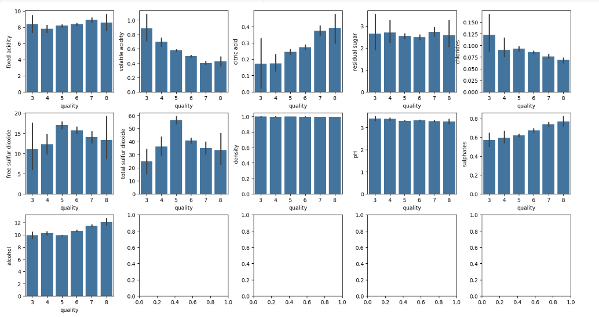
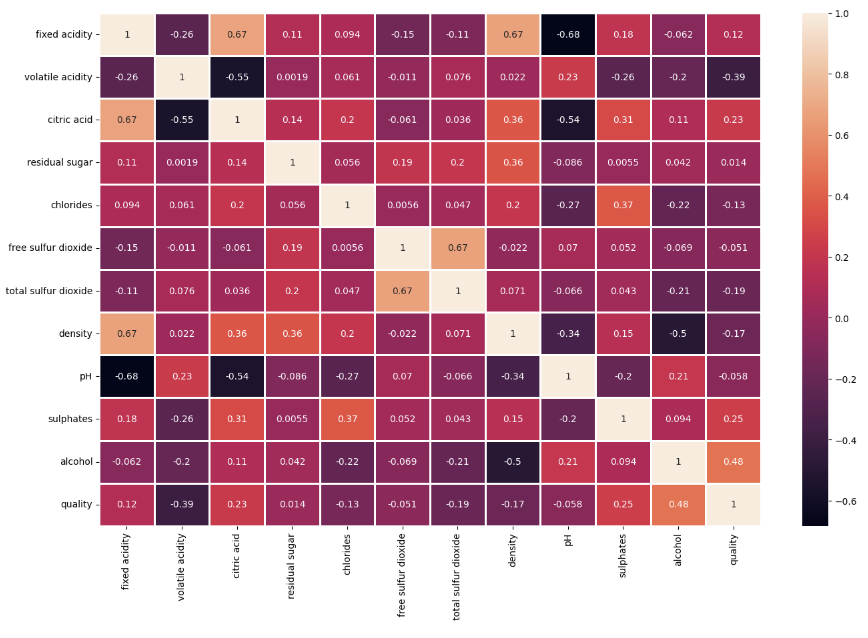

# Prediction of Quality of Wine

This project predicts wine quality using the **Wine Quality** dataset from Kaggle ([link]([https://www.kaggle.com/datasets/mehmetsabrikunt/internet-service-churn/data]). It involves data loading, cleaning, feature analysis, engineering, and addressing class imbalance with SMOTE. Machine learning models are evaluated and optimized to find the best predictor of wine quality based on chemical properties, with a structured workflow for each step.

## Table of Contents
1. [Project Overview](#project-overview)
2. [Dataset](#dataset)
3. [Data Loading](#data-loading)
4. [Feature Analysis](#feature-analysis)
5. [Data Cleaning](#data-cleaning)
6. [Imbalanced Handling (SMOTE)](#imbalanced-handling-smote)
7. [Feature Engineering](#feature-engineering)
8. [Model Analysis](#model-analysis)
9. [Model Optimization](#model-optimization)
10. [Future Work](#future-work)
11. [Contact](#contact)

## Project Overview

The aim of this project is to build a robust wine quality prediction model using machine learning techniques on the **Wine Quality** dataset. The process includes **Imbalanced Handling (SMOTE)** and detailed **Feature Engineering** steps such as **Extract New Features**, **Normalization**, and **Data type conversion**. 

Modeling techniques include:  
- **Hyperparameter Optimization Model**: RandomForest
- **Neural Network Models**: PyTorch, Keras  

Visualizations are presented in **Feature Analysis** and **Model Optimization**, focusing on data insights and performance metrics to identify the most accurate wine quality prediction model.

## Dataset

The **Wine Quality** dataset used in this project is sourced from the [UCI Machine Learning Repository](https://archive.ics.uci.edu/ml/datasets/wine+quality). It contains chemical measurements of red and white wines, such as:

- **Fixed Acidity**: Measures the concentration of non-volatile acids in wine.
- **Volatile Acidity**: Refers to acetic acid in wine, which at high levels can lead to an unpleasant vinegar taste.
- **Citric Acid**: A natural preservative that adds freshness and flavor.
- **Residual Sugar**: The amount of sugar left after fermentation, influencing sweetness.
- **Chlorides**: The amount of salt in the wine.
- **Free Sulfur Dioxide**: Prevents microbial growth and oxidation in wine.
- **Total Sulfur Dioxide**: The total level of SO2, which can affect the flavor if too high.
- **Density**: A factor that can help determine alcohol and sugar levels in wine.
- **pH**: A measure of the acidity/basicity of the wine.
- **Sulphates**: A wine preservative contributing to both the bitterness and microbial stability.
- **Alcohol**: Alcohol content affects the perceived quality and taste.

The **target variable** is the **quality** of wine, scored between 0 and 10, where higher scores represent better quality.

## Data Loading
In this section, we load and examine the raw data to understand its structure, variable types, and key statistics using the following scripts:

- **Unassign_the_Runtime_for_Resetting.py**: Clears the runtime environment to reset cached variables and prevent data conflicts.
- **Upload_the_data.py**: Loads the dataset and performs initial checks, including handling missing values and identifying data types.
- **Definitions_for_the_Columns.py**: Offers detailed descriptions and explanations of each column to improve data comprehension.

### Key Steps:
- Exploring the data: Inspecting missing values, data types, and class distribution.
- Generating summary statistics for both numerical and categorical features.

## Feature Analysis  
The Feature Analysis consists of five key parts: **Statistical Observation**, **Value Range**, **Numerical Features Relationship**, **Heatmap**, and **Class Imbalance**. These steps help in understanding the data distribution, relationships between features, and potential imbalances in the target variable. Further analysis will focus on gaining deeper insights to enhance model performance.

### Statistical Observation
In this section, we perform an initial statistical dataset analysis using the `describe()` function. This provides summary statistics for each feature, including count, mean, standard deviation, minimum, 25th percentile, median (50th percentile), 75th percentile, and maximum values. These statistics help us understand the distribution and range of each feature, allowing for deeper insights into potential feature scaling or transformations needed for model training.

### Value Range
In this section, we analyze the range of values for each feature to understand their distribution and detect any potential outliers. Using the `describe()` function, we summarize each feature's key statistics such as minimum, maximum, mean, and quartiles (25th, 50th, and 75th percentiles). This analysis helps identify which features may require scaling or transformation. Additionally, boxplots visually represent the distribution, highlighting any outliers that could impact model performance.

- **Fixed Acidity**: The distribution is concentrated between 6 and 10, with some outliers above 12.
- **Volatile Acidity**: Most data points fall between 0.2 and 0.6, with several outliers above 1.0.
- **Citric Acid**: The majority of the values range between 0.0 and 0.6, with a few outliers above 1.0.
- **Density**: Most values range from 0.994 to 0.998, with a few outliers slightly above 1.000.
- **pH**: pH values are generally between 3.0 and 3.4, with some outliers below 3.0.

**Boxplot Analysis: Overall Value Distribution**  
The boxplots below show the distribution and range of values for each feature, highlighting potential outliers. The analysis helps identify which features may require scaling or transformation.

### Numerical Features Relationship
In this section, we analyze the relationship between numerical features and wine quality using bar plots. The visualizations help us understand how different chemical properties of wine influence the quality rating.

- **Fixed Acidity**: Shows no clear distinction about wine quality.
- **Volatile Acidity**: The higher the quality of the red wine, the lower the volatile acidity.
- **Citric Acid**: Higher quality wines tend to have higher citric acid content.
- **Density**: Shows no distinction about wine quality.
- **pH**: Also shows no clear relationship with wine quality.

**Barplot Analysis: Feature Relationship with Quality**  
The barplots illustrate the relationship between various features and wine quality. These visualizations help us understand how each feature influences the quality rating. For example, higher-quality wines tend to have lower volatile acidity and higher alcohol content.

   
These insights guide us in selecting relevant features for further modeling and optimization.

### Heatmap
The heatmap below shows the correlation matrix between different features in the dataset. It visually highlights the strength of relationships between pairs of features. A correlation value close to 1 indicates a strong positive relationship, while values close to -1 indicate a strong negative relationship.

Key insights from the heatmap:
- **Citric Acid** shows a positive correlation with **fixed acidity** (0.67).
- **Alcohol** has a moderate positive correlation with **quality** (0.48), suggesting that wines with higher alcohol content tend to have higher quality ratings.
- **Density** and **fixed acidity** also exhibit a notable positive correlation (0.67).
- **pH** and **fixed acidity** have a strong negative correlation (-0.68), indicating an inverse relationship between these two features.

The heatmap helps to identify feature pairs that may influence the outcome (quality) and aids in feature selection for modeling.

### Class Imbalance
The bar plot below illustrates the distribution of wine quality ratings in the dataset. There is a noticeable class imbalance, with the majority of wines rated as **5** and **6**, while fewer wines are rated as **3**, **4**, **7**, or **8**.

To address this imbalance and prevent bias in the machine learning models, we applied **SMOTE** (Synthetic Minority Over-sampling Technique). SMOTE generates synthetic examples for the minority classes to balance the distribution, allowing models to learn more effectively from underrepresented quality ratings.

This technique helps ensure that the model does not favor the majority classes and improves the overall performance in predicting wine quality.

## Data Cleaning
In this section, we ensure that the dataset is properly cleaned and ready for analysis. We begin by inspecting the dataset for missing values and verifying the data types of each feature. As shown in the output of the `info()` function, there are no missing values in the dataset, and all features have the appropriate data types.

Next, we perform a content review to visually inspect the data, ensuring that all entries appear valid and there are no obvious anomalies or incorrect values. This step is crucial to avoid errors in further analysis and modeling. Since no missing or invalid data points were detected, no imputation or data correction steps were necessary for this dataset.

This clean dataset will now be used for feature engineering and model building.

## Imbalanced Handling (SMOTE)
To address the imbalanced distribution of wine quality ratings, we applied **SMOTE** (Synthetic Minority Over-sampling Technique). This technique oversamples the minority classes to balance the dataset.

Steps:
1. Dropped the `quality` column from the feature set (`X`) and assigned it to the target variable (`y`).
2. Applied SMOTE to generate synthetic samples for the minority classes.
3. Merged the resampled data back into a balanced dataset.

The output confirms that each class now has an equal number of samples (681 for each quality rating), making the dataset balanced for model training.

## Feature Engineering
Feature engineering involves creating new features or modifying existing ones to improve the model's performance. In this project, we explore several feature engineering techniques, such as:

- **Polynomial Features**: We create polynomial combinations of existing features (e.g., `pH^2`, `Alcohol * Residual Sugar`) to capture non-linear relationships.
- **Interaction Terms**: Interaction terms are generated between features that may have a combined effect on the target variable.
- **Binning**: We create bins for continuous variables like alcohol content and residual sugar to reduce noise and improve model interpretability.

## Model Analysis
We experiment with a variety of classification models to predict wine quality. These models include:

- **Logistic Regression**: A linear model used for binary classification, applied here to predict multi-class labels by converting the quality score into a classification problem.
- **Decision Tree**: A model that splits the data into branches to predict the quality of wine. It is simple and interpretable but prone to overfitting.
- **Random Forest**: An ensemble model that builds multiple decision trees and averages their predictions, often yielding better results than a single decision tree.
- **Support Vector Machines (SVM)**: A model that finds the optimal hyperplane that separates different classes. SVM is particularly useful for complex, non-linear boundaries.
- **Gradient Boosting**: A boosting algorithm that builds models sequentially, each new model correcting errors made by the previous one. This often leads to high accuracy.

We use **GridSearchCV** to fine-tune hyperparameters for each model to achieve optimal performance.

## Model Optimization

The models are evaluated using various performance metrics, including:

- **Accuracy**: The percentage of correctly classified instances.
- **Precision**: The proportion of predicted positive cases that are actually positive.
- **Recall**: The proportion of actual positive cases that were predicted correctly.
- **F1 Score**: The harmonic mean of precision and recall, providing a balanced metric for classification.
- **Confusion Matrix**: This is used to visualize the true positives, true negatives, false positives, and false negatives for the predictions.

The final model achieves an accuracy of approximately **X%** on the test set (fill in with actual results after training and testing).

## Future Work

If you want to contribute to this project, feel free to fork the repository and submit a pull request. Improvements in model performance or suggestions for new features are always welcome.

## Contact

This project is licensed under the MIT License. See the LICENSE file for more information.
